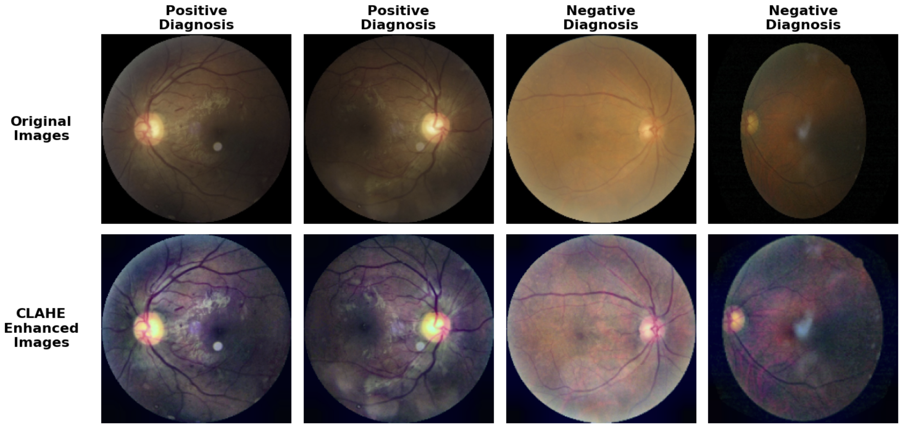
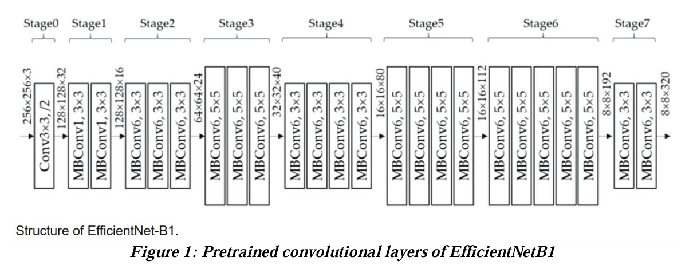
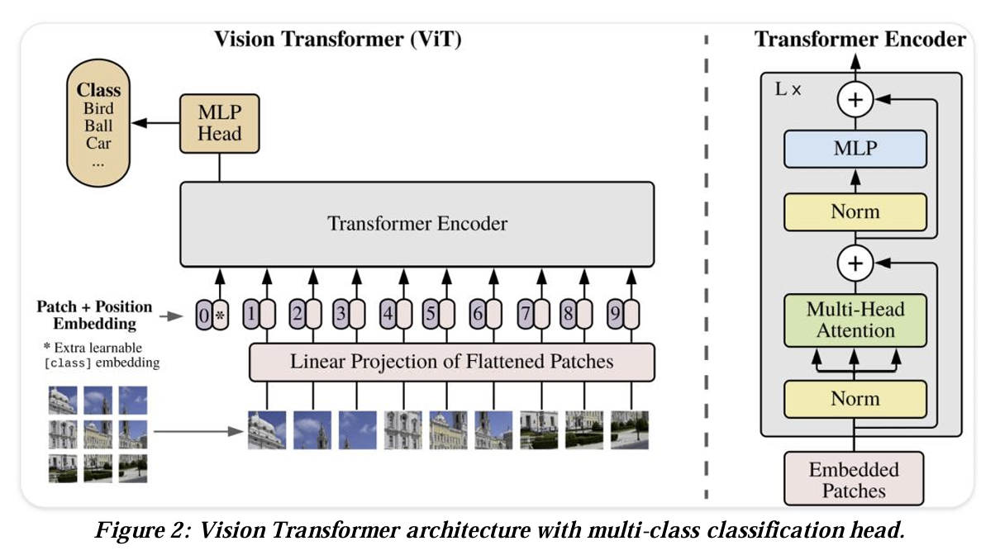

# Diabetic Retinopathy Detection Using Color Fundus Photos  

This project applies machine learning techniques to automate the detection of diabetic retinopathy (DR) using color fundus images. DR is a severe eye condition caused by prolonged high blood glucose and hypertension. Traditional diagnosis requires manual inspection by ophthalmologists, which is costly and time-intensive, but automated DR detection allows for early and more accurate diagnosis to prevent vision loss in diabetic patients. This project assesses the performance of state-of-the-art deep learning models for automated DR detection tasks. These models are evaluated for both accuracy and fairness across demographic groups, which are necessary for precondition for using these models in clinical settings.  

# Dataset  

The ODIR-5K dataset used in this study consists of color fundus images, demographic data, and a binary label indicating whether the patient has Proliferative Diabetic Retinopathy. This dataset poses several challenges such as large variations in image quality and significant class imbalance (~25% positive labels). These challenges reflect real-world data distributions, however, which make it ideal for testing the models ability to generalize across images of varying quality and sources.  

# Preprocessing  

To prepare the images for training, several preprocessing techniques were applied to enhance consistency and quality. Cropping was applied as needed to remove extra space around the fundus and to adjust for major variations in the angle of the images. Contrast Limited Adaptive Histogram Equalization (CLAHE) was used to improve visibility of retinal features such as microaneurysms and exudates. Additional techniques, including flipping and rotation, were also used for data augmentation in order to mitigate overfitting.  

Below is an example of fundus images before and after CLAHE enhancement:  

Other preprocessing methods, such as converting images to grayscale and applying Gaussian filters, were tested but excluded from the final pipeline due to suboptimal results.  

# Models  

Various models were tested in the initial stages of research for this project, and the following two models were selected for further training and tuning. Both were inintialized with pretrained ImageNet weights and extended with a custom classification head configured for binary classification

### EfficientNet (CNN)  
- EfficientNet uses a scalable and efficient convolutional neural network (CNN) architecture that balances model depth, width, and resolution.
- Base model extended with a binary classification head consisting of a global average pooling layer, batch normalization layer, dropout layer, and a dense output layer.

### Vision Transformer (ViT)  
- Employs an encoder-only transformer architecture that splits images into patches and processes them using self-attention mechanisms.
- Base model extended with a binary classification head consisting of a dropout layer, and a dense output layer.

# Training  

The training process involved tuning hyperparameters such as learning rate, dropout rate, batch size, and class weights. A grid search approach was used to identify optimal values, with the final configuration including a learning rate of **`1e-5`**, a dropout rate of **`0.5`**, and a batch size of **`10`**. Metrics such as accuracy, AUC (Area Under the Curve), and confusion matrices were used to evaluate model performance. Subgroup analyses were conducted to assess gender bias, recomputing metrics separately for male and female patients to identify inequities in predictive performance.  

# Results  

| Model             | Accuracy | Overall AUC | Male AUC | Female AUC | AUC Δ  |  
|--------------------|----------|-------------|----------|------------|---------|  
| EfficientNetB0     | 0.793    | 0.778       | 0.776    | 0.781      | **_0.005_**   |  
| EfficientNetB1     | 0.786    | 0.769       | 0.774    | 0.763      | 0.011   |  
| EfficientNetB3     | 0.790    | **_0.803_**       | **_0.810_**    | **_0.794_**      | 0.016   |  
| Vision Transformer | **_0.795_**    | 0.779       | 0.776    | 0.781      | **_0.005_**   |  

EfficientNetB3 achieved the highest AUC (0.803), demonstrating strong suitability for clinical applications. However, its performance showed increased gender bias as model complexity increased. Vision Transformers offered a promising alternative, with comparable accuracy and reduced bias, making them an appealing choice for further exploration.  

# Conclusion  

This study demonstrates the potential of deep learning models for automating diabetic retinopathy detection. While EfficientNetB3 achieved the highest accuracy, its increased bias highlights the importance of addressing fairness as models scale. Vision Transformers, with their robust performance and reduced bias, show significant promise. Future work could explore larger datasets, extended training durations, and advanced fairness strategies to enhance performance further.  
